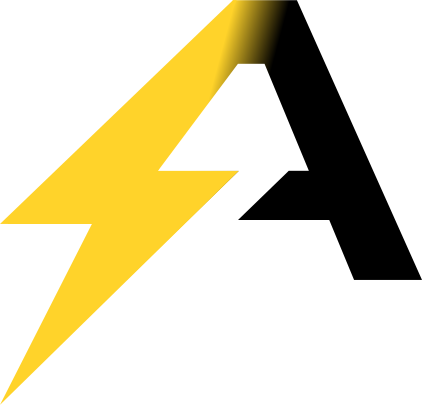

<div align="center">
  <picture>
    <source media="(prefers-color-scheme: dark)" srcset="public/img/agent-dark.svg" />
    
  </picture>

  <p align="center">
    
    
    
    
    
    
  </p>

  <p align="center">
    
  </p>

  <p align="center">
    <i>The marketing &amp; documentation website for Player Map — landing, blog, roadmap &amp; docs.</i>
  </p>
</div>

---

The **website front-end** for [Player Map](https://github.com/Agent-BossFighters/Player-map) —
landing page, blog, roadmap, installation docs and legal pages.

This repository is **only the marketing / documentation site**. It does **not**
contain the graph itself nor the `player-map` component library — the live
interactive graph is a separate app, linked from here via a public URL. The site
needs **zero secrets** to build and run.

Built with **Next.js (App Router)**, **Fumadocs**, **React** and **Tailwind CSS**.

## Stack

| Tool | Role |
| --- | --- |
| [Next.js 16](https://nextjs.org) (App Router, Turbopack) | Framework & build |
| [React 19](https://react.dev) | UI |
| [Fumadocs 16](https://fumadocs.dev) | Documentation engine (`/docs`) |
| [Tailwind CSS v4](https://tailwindcss.com) + `@tailwindcss/typography` | Styling |
| `react-markdown` + `remark-gfm` + `gray-matter` | Blog & legal Markdown rendering |

## Requirements

- **Node.js ≥ 20**
- **[pnpm](https://pnpm.io)** (recommended — a `postinstall` step generates the
  Fumadocs content types)

## Getting started

```bash
pnpm install        # also runs `fumadocs-mdx` to generate content types
pnpm dev            # start the dev server
```

Open <http://localhost:3000>.

## Scripts

```bash
pnpm dev            # development server (Turbopack)
pnpm build          # production build
pnpm start          # serve the production build
pnpm lint           # ESLint
pnpm types:check    # generate content/route types + tsc --noEmit
```

## Environment variables

All variables are **public** (`NEXT_PUBLIC_*`) and **optional** — the site builds
and runs without any of them. **No secret is ever required.**

| Variable | Default | Purpose |
| --- | --- | --- |
| `NEXT_PUBLIC_APP_URL` | `https://playermap.box/test-player-map/index.html` | Target of the **"Launch app"** button (the live graph app). |
| `NEXT_PUBLIC_SITE_URL` | `https://playermap.box` | Canonical site URL used for Open Graph / social-share image resolution. |

Create a `.env.local` to override them locally:

```bash
NEXT_PUBLIC_APP_URL=https://your-graph-app.example
NEXT_PUBLIC_SITE_URL=https://your-site.example
```

## Project structure

```
src/
├── app/
│   ├── (home)/            # Landing, blog, roadmap, legal & open-source pages
│   │   ├── page.tsx           # Landing (hero + marketing sections)
│   │   ├── blog/              # /blog, /blog/page/[n], /blog/[slug]
│   │   ├── roadmap/           # /roadmap (year tabs + expand/collapse)
│   │   ├── open-source/       # /open-source
│   │   └── *-*/page.tsx       # Legal pages (notice, privacy, terms, risk)
│   ├── docs/[[...slug]]/  # Fumadocs documentation layout & pages
│   ├── api/search/        # Fumadocs search route handler
│   └── og/, llms.*        # Open Graph images & llms.txt endpoints
├── components/            # Footer, custom scrollbar, blog list, share button, …
├── lib/
│   ├── shared.ts             # Brand name, links, app URL, git config
│   ├── layout.shared.tsx     # Navbar (logo + nav links)
│   ├── source.ts             # Fumadocs content source loader
│   └── blog.ts               # Blog post loading & pagination
└── content/legal/        # Legal pages content (Markdown)

content/
├── docs/                 # Documentation (Fumadocs MDX + meta.json ordering)
└── blog/                 # Blog posts (Markdown + frontmatter)
```

## Editing content

- **Docs** — add an `.mdx` file under `content/docs/` (use `meta.json` in a folder
  to set its sidebar title and page order). See the existing sections for the
  frontmatter shape (`title`, `description`).
- **Blog** — add a Markdown file under `content/blog/` with frontmatter
  (`title`, `description`, `date`, `author`, optional `image`). Pagination is
  automatic (`POSTS_PER_PAGE` in `src/lib/blog.ts`).
- **Legal** — edit the Markdown files in `src/content/legal/`.

> Note on code blocks in docs: the syntax highlighter (Shiki) does not know the
> `env`/`gitignore` languages — use `ini` and `bash` instead.

## Design

Dark theme with the Player Map signature gold accent **`#ffd32a`**. Brand tokens
and global overrides live in `src/app/global.css`.

## Deployment

Standard Next.js deployment (e.g. Vercel, or any Node host):

```bash
pnpm build && pnpm start
```

Remember to set `NEXT_PUBLIC_SITE_URL` (and optionally `NEXT_PUBLIC_APP_URL`) in
the deployment environment so social-share links and the "Launch app" button
point to the right places.
